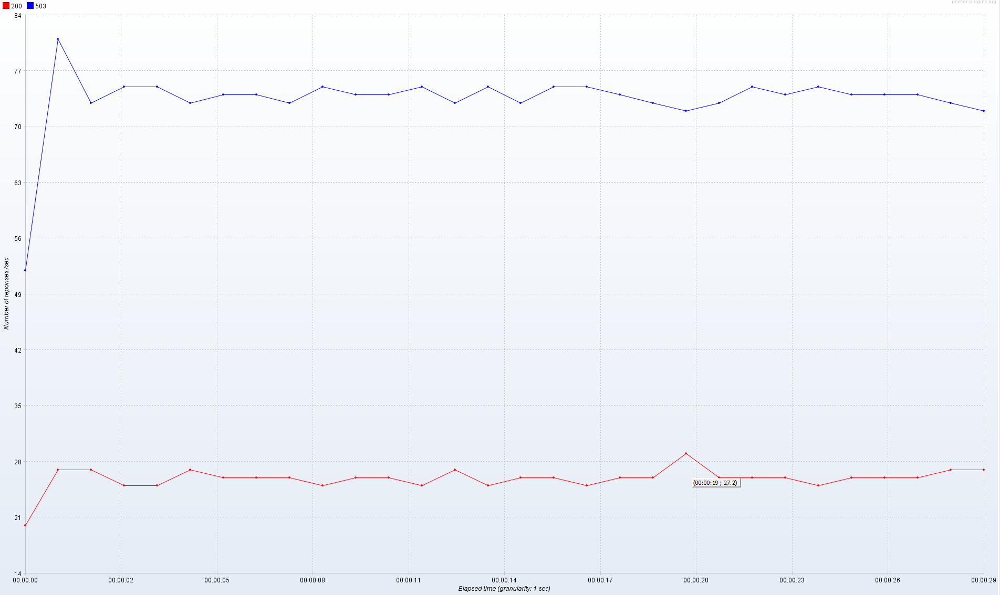
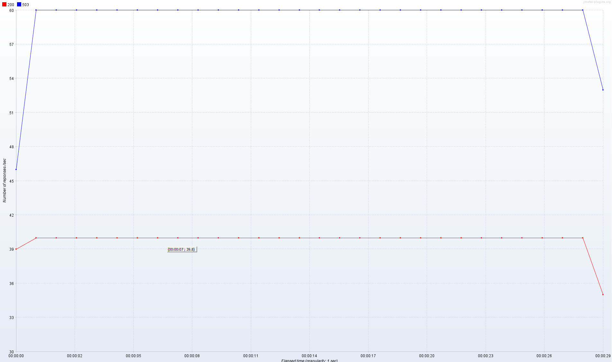
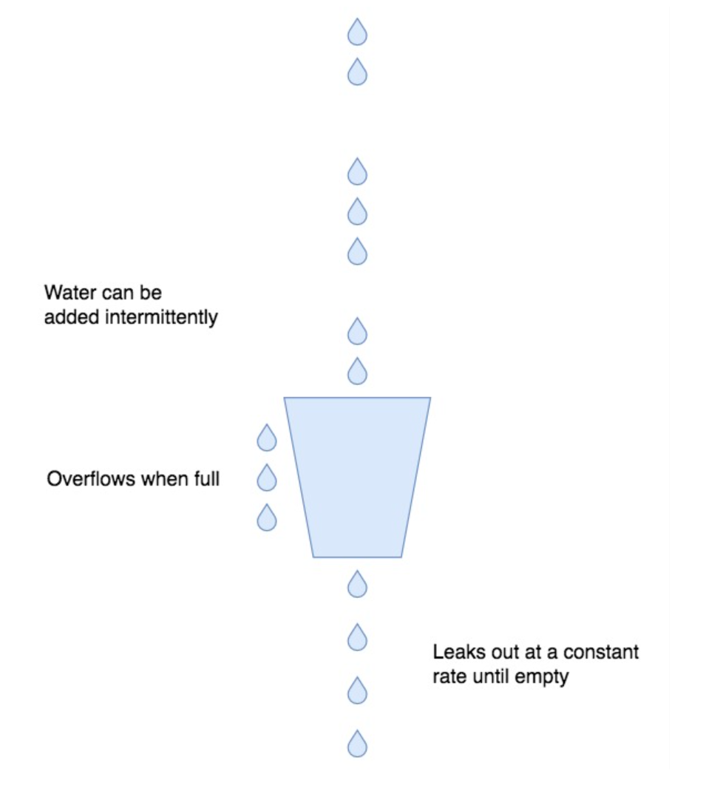
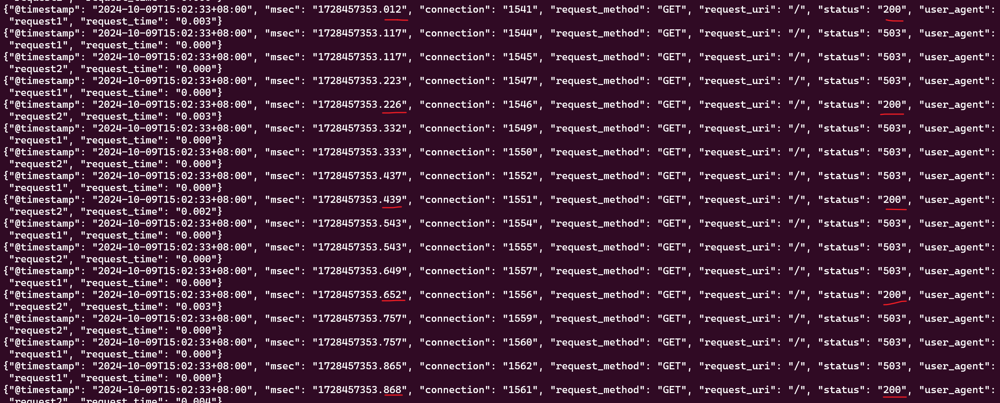

# 一、背景
2024年9月，某系统安全答题活动过程中，有大量的请求访问，超过了业务系统处理能力。在通过nginx对请求进行限流的过程中，nginx疑似未达到设置的200 QPS，就已经拒绝了请求，本文对该问题进行分析。
# 二、限流插件介绍
配置示例
```
http {
    # 定义限速规则
    # $binary_remote_addr：按照IP进行限速
    # zone=one:10m：分配一块内存区域，名称叫one，大小10m，用这块内存中统计每个IP的QPS
    # rate=1r/s：限速每秒一次请求
    limit_req_zone $binary_remote_addr zone=one:10m rate=1r/s;

    ...

    server {

        ...

        location /search/ {
            # 对/search/这个url应用限速
            # zone=one：使用zone=one这块内存区域，统计各个IP的请求次数
            # burst=5：触发限速时允许5个突发流量
            limit_req zone=one burst=5 nodelay;
        }
```
更详细的设置可以参考参考资料3《Nginx模块 ngx_http_limit_req_modules官方文档》
# 三、问题复现
检查限速插件各个参数的说明，达不到指定的QPS怀疑burst参数设置问题，在改的场景中，没有设置burst参数，官方文档对这个参数的描述是“允许突发请求的大小”，语焉不详，对这个参数进行实际测试。用jmeter模拟20个用户，发起100QPS的请求进行压测。Nginx设置限速40r/s，比较不设置burst参数和设置burst参数的限流情况。
**场景一 不设置burst**
不设置默认burst=0
限速配置：
```
 ...
 limit_req_zone limit zone=one:10m rate=40r/s;
    ... 
    limit_req zone=one;
    ... 
```
压测结果：


**场景二 设置burst=5**
限速配置：
```
 ...
 limit_req_zone limit zone=one:10m rate=40r/s;
    ... 
    limit_req zone=one burst=5;
    ... 
```
压测结果：


可以看到，不设置burst参数QPS甚至达不到30(红色曲线)，每秒有70个请求被Nginx限流拒绝，返回503。设置burst参数之后，可以实现稳定的限流40 QPS。因此没达到限速的QPS请求就被限流的直接原因在于：没有设置burst参数，下面对Nginx限流机制进行分析，看看导致这种差异的根本原因。
# 四、限流原理
nginx使用漏桶算法进行限流，可以用这张图描述：

关于这张图，有几点说明：
1. 桶上方的水代表进入nginx的请求，速度是**不可控**的
2. 桶下方的水是nginx限流后允许向后端转发的请求，是**匀速** 的，这对上游的应用系统很友好
3. 桶有一定的容量，超过**桶容量**（桶容量由burst参数控制）的请求会被丢弃

想象一下，要实现匀速的出水，桶的作用至关重要。因为进水的速度是不可控的，如果没有桶承接多余的水，多出来的水就只能被丢弃，同事下方滴出来的水也做不到匀速。
下面分析限速具体的实现逻辑：
```
          ...
            # 对每一条请求执行下述限流判断
            # 计算当前请求和上一次请求的时间差ms,单位是毫秒
			ms = (ngx_msec_int_t) (now - lr->last);
          
            if (ms < -60000) {
                ms = 1;
            } else if (ms < 0) {
                ms = 0;
            }
            # excess，rate都放大了1000，便于理解可以简化成excess = excess - rate * ms / 1000 + 1
            #下面这行代码的作用是：
		    # 当前排队的请求数量 = 累计排队的请求数量 - ms时间内允许通过的请求次数 + 1（当前这个请求）
            excess = lr->excess - ctx->rate * ms / 1000 + 1000;

            if (excess < 0) {
                excess = 0;
            }

            *ep = excess;
            # 还在排队的请求数量 超过的桶的容量，触发限流, 返回503
            if ((ngx_uint_t) excess > limit->burst) {
                return NGX_BUSY;
            }
            ...
```
在burst=0的情况下，如果excess >0 ，则会触发限流, 返回503。考虑简化后计算排队请求数量的这段代码：excess = excess - rate * ms / 1000 + 1 这段代码（含义是当前排队的请求数量 = 累计排队的请求数量 - ms时间内允许通过的请求次数 + 1（当前这个请求）），在初始状态下excess = 0，那么必须有ms >= 1000/rate，才会允许请求通过。 假设rate=200r/s, 则ms >= 5，这意味着rate=200r/s， burst=0时，两次请求的时间间隔必须大于等于5ms，否则第二次请求就会被限流。同时得到下面的规律：

| 限速（rate） | 两次请求不被限流时间间隔 (interval) | 两次请求不被限流时间间隔计算方法 |
| ---- | ---- | ---- |
| 200 | >=5ms | 1000/rate |
| 100 | >=10ms | 1000/rate |
| 50 | >=20ms | 1000/rate |
| 10 | >=100ms | 1000/rate |
| 2 | >=500ms | 1000/rate |

这意味着限速为rate，burst为0的情况下，需要以大于对应interval时间间隔均匀地请求Nginx，才能达到rate指定的限速，而在实际业务中请求不可能这么均匀，因此活动平台的场景中才会出现还没达到限速的QPS Nginx就已经拒绝了连接的情况。解决方案是设置burst参数允许不那么均匀的流量通过，这样才能实现指定的QPS限速。
# 五、限流验证
按照上面的分析，rate=5r/s， burst=0时，nginx每200ms允许一个请求转发到后端，200ms之间的请求都会被限流拒绝，下面对这个结论进行验证，nginx配置如下：
```
 limit_req_zone limit zone=one:10m rate=5r/s;
 server {
        listen       80;
        server_name  localhost;


        location / {
                limit_req zone=one;
                proxy_pass http://127.0.0.1:8000;
        }


        error_page   500 502 503 504  /50x.html;
        location = /50x.html {
            root   html;
        }

   }
```
每100ms向Ngixn发起2次请求，可以看到，每200ms Nginx会通过一个请求到后端，200ms之间的所有请求都被限流拒绝。


上述过程中模拟的流量是均匀请求到Nginx，但实际上的业务流量不会这么均匀。如果1秒内的这5笔请求都在200ms之内同时发起，只有第一笔交易会被Nginx转发到后端，另外4笔都会被限流拒绝，实际的QPS就是1。因此会出现还没达到QPS=5就拒绝了请求的情况。
# 六、总结
- 限速参数rate的含义是：每1000/rate毫秒允许一个请求通过
- 未设置burst参数时，不是按照每1000/rate毫秒匀速到达Nginx的请求会被拒绝，导致转发到后端的请求无法达到指定的QPS。而真实的流量不会是匀速的，要实现指定的QPS限流必须设置burst参数，允许非匀速的突发流量。
- burst参数初始值可以设置为5，如果不能实现稳定限流，则说明业务突发流量较大，继续调大直到稳定限流。
- nodelay/delay参数会和burst共同影响限流，一般设置nodelay即可，详细可参考《2.NGINX速率限制原理及源码分析》


# 七、参考资料
1. [Nginx限速模块源码](https://github.com/nginx/nginx/blob/master/src/http/modules/ngx_http_limit_req_module.c)。
2. [NGINX速率限制原理及源码分析](https://www.nginx.org.cn/article/detail/369)
3. [Nginx模块 ngx_http_limit_req_modules官方文档](https://nginx.github.net.cn/en/docs/http/ngx_http_limit_req_module.html)